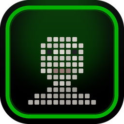
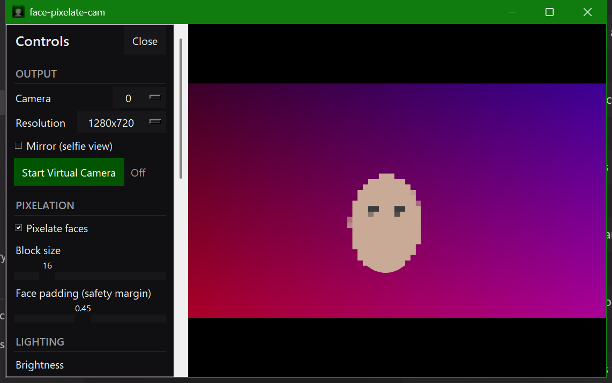

# face-pixelate-cam

  

A portable Windows app that **pixelates only faces** in your webcam feed. The
body and background stay untouched, so you can bring a face-blurred camera into
**OBS, Streamlabs, or Teams**.

Everything lives in **one window**: your video fills it, and a **hamburger menu
(the ☰ in the top-left corner)** opens a control panel with labeled sliders and
toggles, so there is nothing to memorize. Get the video into your streaming app
two ways:

- **Window Capture** (easiest: capture this app's window; no extra install), or
- **Virtual camera** (appears as a camera device; needs the OBS virtual-cam driver).

It also includes live **lighting** controls (brightness, contrast, saturation,
warmth, gamma).

  

---

## Download

**[Download the latest release (face-pixelate-cam.zip)](https://github.com/phurteau/face-pixelate-cam/releases/latest)**

1. Download and **extract** the zip.
2. Double-click **`setup.bat`** once (needs Python 3.9–3.14, 64-bit).
3. Double-click **`run.bat`**. The app window opens; click the corner **☰**
   menu for all controls, then add a **Window Capture** source in
   OBS/Streamlabs (see below).

*(Alternatively, use the green **Code > Download ZIP** button for the latest
`main`, or `git clone` the repo.)*

---

## What it does

- **Face pixelation (faces only).** Detection runs on **every frame** with
  OpenCV's **YuNet** face detector, so the pixel block **follows your face**
  anywhere in the room and **resizes** as you move closer/farther. Handles
  **multiple faces**.
- **Safety-biased tracking.** Boxes are padded and a "hold last position"
  buffer keeps faces covered during **fast motion** or **profile angles** so a
  frame with an exposed face is very unlikely.
- **Lighting:** brightness, contrast, saturation, warmth (white balance),
  gamma, all adjustable live.

---

## Requirements on your personal PC

1. **Python 3.9–3.14** (64-bit). Install from
   <https://www.python.org/downloads/> and tick **"Add Python to PATH"**.
   Any current version works, including **3.13 / 3.14**, because face
   detection uses OpenCV YuNet (prebuilt wheels, no compiler, no MediaPipe).
2. **The bundled model file** `face_detection_yunet_2023mar.onnx` must stay in
   the folder next to `pixelate_cam.py` (it's ~230 KB and ships with the app).
3. **A way to get the video into your streaming app.** There are two options.
   **Window Capture is the easy one and needs no extra install:**
   - **Window Capture (recommended):** OBS and Streamlabs can capture the app's
     own window directly. **Nothing else to install.** <- start here
   - **Virtual camera (optional):** to make it appear as a *camera device*, you
     must install [OBS Studio](https://obsproject.com), open it once, click
     **Start Virtual Camera** then **Stop Virtual Camera**, and close OBS (this
     registers the driver). Streamlabs' own virtual camera is a different device
     the app can't use. If you don't need a "camera", skip this entirely.

---

## Setup (do this once)

1. Copy the whole **`face-pixelate-cam`** folder to your personal PC.
2. Double-click **`setup.bat`**. It creates a local `.venv` and installs
   everything (takes a few minutes the first time).

## Run Method A: Window Capture (recommended, no driver needed)

1. Double-click **`run.bat`**. The app window opens and shows your pixelated
   video. Move your mouse away and the corner **☰** button fades out, so the
   window is clean to capture.
2. In **OBS or Streamlabs**: **+ (Add Source) -> Window Capture -> Add new ->**
   pick the window titled **"face-pixelate-cam"**.
   - If the capture looks black, set the Window Capture's **Capture Method** to
     **"Windows 10 (1903 and up)"** (Streamlabs/OBS have this dropdown).
3. Resize/crop the source in your scene as usual. Faces stay pixelated as you
   move.

**To adjust anything** (block size, brightness, camera, etc.): click the corner
**☰** to open the control panel, change what you want, then click **Close**.
The panel opens on the left inside the same window; the video shifts beside it
so your face stays visible while you adjust. Close the panel before going live,
or crop the source to just the video area.

**To stop:** close the window (its **X**) or press **q** / **Esc**.

## Run Method B: Virtual camera (appears as a "camera" in Teams/OBS/Streamlabs)

1. **Install OBS Studio first.** This step is required. The virtual camera is
   provided by OBS's driver (see Requirements #3). Without OBS installed, the
   camera cannot start and won't appear anywhere.
2. Double-click **`run.bat`** and open the **☰** menu.
3. Under **Output**, click **Start Virtual Camera**. The status next to it turns
   to **On**. If it can't start (OBS driver missing), a **pop-up** explains why
   and the reason is written to `run-log.txt`.
4. Pick **"OBS Virtual Camera"** as your camera:
   - **Microsoft Teams:** Settings -> Devices -> **Camera** -> "OBS Virtual Camera"
     (if Teams was already open, fully quit and reopen it so it re-scans cameras).
   - **OBS/Streamlabs:** Add Source -> **Video Capture Device** -> "OBS Virtual Camera".
   - Keep **this app running** the whole time. The camera only exists while it's open.
5. **To stop the camera:** click **Stop Virtual Camera** (or just close the app).

> Not seeing the camera? Run **`diagnose.bat`**. It tells you exactly why the
> virtual camera won't start and saves the result to `diagnose-log.txt`. If you
> don't want to install OBS at all, use **Method A (Window Capture)** instead.

### Handy launch options

Every setting has a control in the **☰** panel, but you can also preset them on
the command line:

| Command | Effect |
|---|---|
| `run.bat` | Open the app (camera 0, 1280x720). |
| `run.bat --camera 1` | Use a different webcam (try 1, 2, ...). |
| `run.bat --mirror` | Start in selfie/mirror view. |
| `run.bat --width 1920 --height 1080 --fps 30` | Force a resolution. |
| `run.bat --accent "#3aa0ff" --theme light` | Preset the accent color and theme. |
| `run.bat --no-update-check` | Skip the check for a newer version. |
| `run.bat --version` | Print the version and exit. |

(`run-clean.bat` still works and is identical to `run.bat`; it is kept only so
old shortcuts keep working.)

---

## Controls

Open the panel with the corner **☰** button (or press **`h`**). Everything is a
labeled control, grouped into sections:

- **Output:** camera, resolution, mirror (selfie view), and **Start / Stop
  Virtual Camera** with a live status.
- **Pixelation:** turn face pixelation on/off, block size, and face padding
  (the safety margin around each face).
- **Lighting:** brightness, contrast, saturation, warmth, gamma, and a
  **Reset lighting** button.
- **Appearance:** a light/dark **theme** toggle and the accent color picker.
- **Save settings** writes your tweaks to `settings.json`; **Reset all** returns
  everything to defaults.

A few keyboard shortcuts work when the window has focus:

| Key | Action |
|---|---|
| `q` / `Esc` / close window (X) | Quit |
| `h` | Open / close the control panel |
| `p` | Toggle pixelation on/off (panic peek) |

Your tweaks persist to **`settings.json`** (click **Save settings**). Delete
that file to return to defaults.

---

## Updates

On launch the app quietly checks GitHub for a newer release (in the background,
it never blocks video, and silently does nothing if you're offline). If a newer
version exists, a **Download update** button appears at the bottom of the
control panel.

- Click it to fetch the new release zip into your **Downloads** folder and open
  Explorer to it. Extract it and run `setup.bat` to update.
- Launch with `run.bat --no-update-check` to skip the check entirely. Check your
  version with `run.bat --version`.

---

## Theming & accent color

The UI is a **token-based, dual-theme** system: a **true-black dark** theme
(default) plus a soft off-white **light** theme, both with neutral-gray panels.
A single user-chosen **accent** color drives *every* highlight: buttons, active
states, the accent slider handles, and the swatch. Any accent looks good against
the neutral surfaces.

- In the **Appearance** section of the panel, use the **accent picker**: an
  **HSV color wheel** (hue = angle, saturation = distance from center) with a
  **Brightness** slider, a live swatch, a hex box you can type into, and a
  **Reset** button. Drag on the wheel or edit the hex to change the accent live.
- The accent's companion shade is derived automatically (a brighter tint for
  active borders and slider handles), and text on an accent fill is auto black
  or white by luminance so it always stays readable.
- **Default theme is dark; default accent is `#025500`** (a dimmed green).
- Your theme and accent **persist** to `settings.json`. You can also set them
  from the command line: `run.bat --accent "#3aa0ff" --theme light`.
- Panel text uses your system **Segoe UI** font for a clean, native look.

---

## Troubleshooting

- **The virtual camera won't appear in Teams / OBS / Streamlabs** -> it is
  provided by **OBS Studio's** driver, so OBS Studio must be installed. The app
  tells you when the camera can't start: a **pop-up** appears and the reason is
  written to `run-log.txt`. Fix: install OBS Studio, open it once, click **Start
  Virtual Camera** then **Stop Virtual Camera**, close OBS, and try again. Then
  open the **☰** panel, click **Start Virtual Camera**, and pick **"OBS Virtual
  Camera"** as your camera. In **Teams**, fully quit and reopen it after
  starting the camera so it re-scans cameras. Keep this app **running** the whole
  time. Run **`diagnose.bat`** for a full check.
- **Don't want to install OBS?** -> skip the virtual camera entirely: run
  **`run.bat`** and add a **Window Capture** source pointed at the
  "face-pixelate-cam" window. No driver needed.
- **Window Capture shows black** -> in the source's properties set **Capture
  Method -> "Windows 10 (1903 and up)"**, and don't minimize the app window.
- **"could not open camera index 0"** -> another app is using the webcam, or the
  index is wrong. Close other apps, or pick a different **Camera** in the panel
  (or `run.bat --camera 1`).
- **Face flickers when I turn fully sideways** -> raise **Face padding** in the
  panel (or `hold_frames` in `settings.json`). Face detectors are weakest on
  full profiles; the padding + hold buffer cover the gap.
- **Face gets exposed at the edge of the frame** -> this is handled: detection
  runs on a mirror-padded frame so half-off-edge faces are still found, and the
  box is "glued" to the frame border so it can't leave an exposed sliver. If you
  push it (very fast exits), raise `hold_frames` or `padding` in `settings.json`.
- **"YuNet model not found"** -> the file `face_detection_yunet_2023mar.onnx`
  must be in the same folder as `pixelate_cam.py`. Re-download it from the
  OpenCV Zoo if it's missing.
- **Low frame rate** -> lower the resolution in the panel (or
  `run.bat --width 960 --height 540`).

---

## Uninstall

This app is **portable**: nothing is installed system-wide (no registry, no
Program Files, no Start-menu entries, no driver). Its entire footprint is the
app folder itself, plus any update `.zip` the auto-updater saves to your
**Downloads**. To remove it:

- **Easiest:** just delete the whole `face-pixelate-cam` folder.
- **Or run `uninstall.bat`**, which fully cleans up in three steps:
  1. Removes every generated file: `.venv`, `settings.json`, all logs
     (`run-log.txt`, `setup-log.txt`, `diagnose-log.txt`), `__pycache__`,
     `build`, `dist`, `*.spec`. This resets the folder to just the source.
  2. Offers to delete any `face-pixelate-cam-*.zip` the updater left in your
     **Downloads** (the only thing the app ever writes outside its own folder).
  3. Then asks if you also want to **delete the entire folder** (`y` = full
     removal, including itself).

> `uninstall.bat` does **not** remove the OBS/Streamlabs **Virtual Camera
> driver**. That belongs to Streamlabs/OBS and other apps may use it. Remove
> it from Streamlabs/OBS if you no longer want it.

---

## How the "faces only" part works

Each frame, OpenCV's YuNet detector returns bounding boxes for detected faces.
The app pixelates **only those rectangles** (down-scale then nearest-neighbor
up-scale), copying the blocks back over the face region. Every other pixel is
the original frame, so your body and background are unchanged.

**Edge handling:** detection runs on a mirror-padded copy of the frame, so a
face that is half cut off at the border is still detected (its mirrored half
completes it). Boxes near a border are extended to the frame edge, so a face
moving out of frame is never briefly exposed at the very edge.

---

## License

MIT. See [LICENSE](LICENSE). Free to use, modify, and share.
