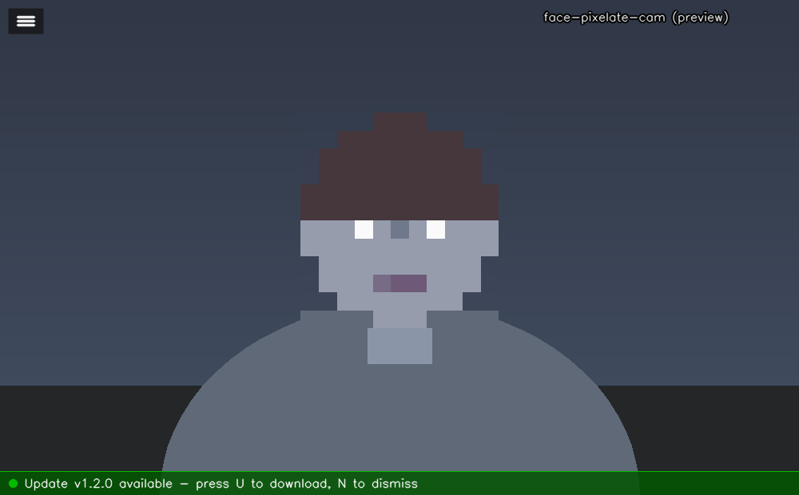
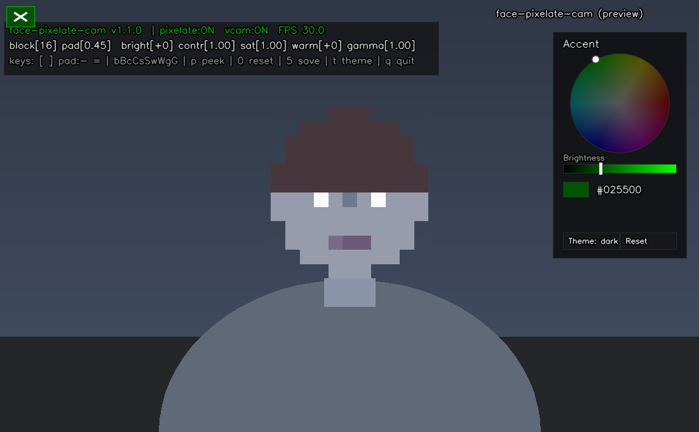

# face-pixelate-cam

A portable Windows app that **pixelates only faces** in your webcam feed - the
body and background stay untouched - so you can bring a face‑blurred camera into
**OBS or Streamlabs**. Get it on screen two ways:

- **Window Capture** (easiest - capture the app's window; no extra install), or
- **Virtual camera** (appears as a camera device; needs the OBS virtual‑cam driver).

It also includes live **lighting** controls (brightness, contrast, saturation,
warmth, gamma).

---

## Download

**[⬇️ Download the latest release (face-pixelate-cam.zip)](https://github.com/phurteau/face-pixelate-cam/releases/latest)**

1. Download and **extract** the zip.
2. Double‑click **`setup.bat`** once (needs Python 3.9–3.14, 64‑bit).
3. Double‑click **`run-clean.bat`** and add a **Window Capture** source in
   OBS/Streamlabs (see below).

*(Alternatively, use the green **Code ▸ Download ZIP** button for the latest
`main`, or `git clone` the repo.)*

---

## What it does

- 🟦 **Face pixelation (faces only).** Detection runs on **every frame** with
  OpenCV's **YuNet** face detector, so the pixel block **follows your face**
  anywhere in the room and **resizes** as you move closer/farther. Handles
  **multiple faces**.
- 🛡️ **Safety‑biased tracking.** Boxes are padded and a "hold last position"
  buffer keeps faces covered during **fast motion** or **profile angles** so a
  frame with an exposed face is very unlikely.
- 💡 **Lighting:** brightness, contrast, saturation, warmth (white balance),
  gamma - all adjustable live.

---

## Requirements on your personal PC

1. **Python 3.9–3.14** (64‑bit). Install from
   <https://www.python.org/downloads/> and tick **"Add Python to PATH"**.
   Any current version works - including **3.13 / 3.14** - because face
   detection uses OpenCV YuNet (prebuilt wheels, no compiler, no MediaPipe).
2. **The bundled model file** `face_detection_yunet_2023mar.onnx` must stay in
   the folder next to `pixelate_cam.py` (it's ~230 KB and ships with the app).
3. **A way to get the video into your streaming app.** There are two options -
   **Window Capture is the easy one and needs no extra install:**
   - **Window Capture (recommended):** OBS and Streamlabs can capture the app's
     own window directly. **Nothing else to install.** ← start here
   - **Virtual camera (optional):** to make it appear as a *camera device*, you
     must install [OBS Studio](https://obsproject.com), open it once, click
     **Start Virtual Camera** then **Stop Virtual Camera**, and close OBS (this
     registers the driver). Streamlabs' own virtual camera is a different device
     the app can't use. If you don't need a "camera", skip this entirely.

---

## Setup (do this once)

1. Copy the whole **`face-pixelate-cam`** folder to your personal PC.
2. Double‑click **`setup.bat`**. It creates a local `.venv` and installs
   everything (takes a few minutes the first time).

## Run - Method A: Window Capture (recommended, no driver needed)

1. Double‑click **`run-clean.bat`**. A window opens showing your **bare
   pixelated video** - no buttons or text, so it's clean to capture.
2. In **OBS or Streamlabs**: **+ (Add Source) → Window Capture → Add new →**
   pick the window titled **"face-pixelate-cam (preview)"**.
   - If the capture looks black, set the Window Capture's **Capture Method** to
     **"Windows 10 (1903 and up)"** (Streamlabs/OBS have this dropdown).
3. Resize/crop the source in your scene as usual. Faces stay pixelated as you
   move.

**To stop:** close the window (its **X**), press **q** / **Esc**, or close the
black console window.

**To adjust settings (block size, brightness, etc.) in clean mode:** press
**`h`** (or click the top‑left corner) to summon the controls overlay, change
things with the hotkeys below, then press **`h`** again to go bare. Tip: press
**`5`** to save your settings - `run-clean.bat` will reuse them next time, so you
can configure once and always stream bare.

> Keep the app window **open and not minimized** while streaming. You can move
> it off to the side of your screen; Window Capture still grabs it. (While the
> overlay is showing, your capture would show it too - so hide it with `h`
> before going live, or adjust during setup.)

## Run - Method B: Virtual camera (appears as a "camera")

1. Do the one‑time **OBS Studio** step in Requirements #3 above.
2. Double‑click **`run.bat`**. A preview window opens (with a small corner
   button) and the **virtual camera** starts. The console should print
   `Virtual camera: OBS Virtual Camera`.
3. In **Streamlabs**: **+ (Add Source) → Video Capture Device → Add → pick
   "OBS Virtual Camera"**. Keep the app running the whole time.
4. **To stop:** close the preview window (**X**) or press **q**. (The corner
   button shows/hides the settings overlay - it does not quit.)

> Not seeing the camera? Run **`diagnose.bat`** - it tells you exactly why the
> virtual camera won't start and saves the result to `diagnose-log.txt`.

### Handy launch options

| Command | Effect |
|---|---|
| `run-clean.bat` | **Window Capture mode** - bare video, no overlay, no virtual cam. |
| `run.bat` | Virtual‑camera mode (camera 0, 1280×720). |
| `run.bat --camera 1` / `run-clean.bat --camera 1` | Use a different webcam (try 1, 2, …). |
| `run-clean.bat --mirror` | Selfie/mirror view. |
| `run.bat --width 1920 --height 1080 --fps 30` | Force a resolution. |
| `run.bat --no-vcam` | Preview only (test without the virtual cam). |
| `run.bat --clean` | Bare video but keep other defaults. |

---

## Hotkeys (focus the preview window)

The overlay is **hidden by default** for a clean preview. Click the small
**corner button** (top‑left) or press **`h`** to show/hide it.

| Key | Action |
|---|---|
| `q` / `Esc` / close window (X) | Quit |
| `h` / corner button | Show/hide the settings overlay |
| `t` | Open the theme / accent color‑wheel picker |
| `[` / `]` | Pixel block size - smaller / larger blocks |
| `-` / `=` | Face padding - less / more safety margin |
| `b` / `B` | Brightness down / up |
| `c` / `C` | Contrast down / up |
| `s` / `S` | Saturation down / up |
| `w` / `W` | Warmth cooler / warmer |
| `g` / `G` | Gamma down / up |
| `p` | Toggle pixelation on/off (panic peek) |
| `0` | Reset lighting to neutral |
| `5` / `9` | Save / reload `settings.json` |
| `U` / `N` | Download the update / dismiss the update banner (only shown when an update is available) |

Your tweaks persist to **`settings.json`** (press **5** to save). Delete that
file to return to defaults.

---

## Updates

On launch the app quietly checks GitHub for a newer release (in the background -
it never blocks video, and silently does nothing if you're offline). If a newer
version exists, a green **banner** appears along the bottom of the window:

- Press **`U`** for a one‑click download: it fetches the new release zip into
  your **Downloads** folder and opens Explorer to it. Extract it and run
  `setup.bat` to update.
- Press **`N`** to dismiss. The banner also **auto‑hides after ~20 seconds** so
  it never lingers on a stream, and it's drawn on the preview only (it never
  appears on the virtual‑camera output).
- Launch with `run.bat --no-update-check` (or `run-clean.bat --no-update-check`)
  to skip the check entirely. Check your version with `run.bat --version`.

---

## Theming & accent color

The UI is a **token‑based, dual‑theme** system: a **true‑black dark** theme
(default) plus a soft off‑white **light** theme, both with neutral‑gray panels.
A single user‑chosen **accent** color drives *every* highlight - the corner
button's active state, the version line, the update banner, the picker, and
focus/active states - so any accent looks good against the neutral surfaces.

- Press **`t`** to open the **accent picker**: an **HSV color wheel** (hue =
  angle, saturation = distance from center) with a **Brightness** slider, a live
  swatch + hex readout, a **Theme: dark/light** toggle, and a **Reset** button.
  Drag on the wheel or slider to change the accent live.
- The accent's companion shades are derived automatically: a brighter
  `acc2` (for glows/hover/active borders) and an `acc-ink` (black or white,
  chosen by luminance) so text on an accent fill always stays readable.
- **Default theme is dark; default accent is `#025500`** (a dimmed green).
- Your theme and accent **persist** to `settings.json` (saved when you close the
  picker or press **`5`**). You can also set them from the command line:
  `run.bat --accent "#3aa0ff" --theme light`.

---

## Troubleshooting

- **Can't get it to show as a camera in OBS/Streamlabs** → easiest fix: don't
  use the virtual camera at all. Run **`run-clean.bat`** and add a **Window
  Capture** source pointed at the "face-pixelate-cam (preview)" window. No
  driver needed. (Use the virtual camera only if you specifically want a
  *camera device*.)
- **Streamlabs doesn't list the camera** (virtual‑cam method) → it appears as
  **"OBS Virtual Camera"**, not "face-pixelate-cam". If it's missing entirely,
  run **`diagnose.bat`** - it pinpoints why. Usual cause: OBS Studio's virtual
  camera driver isn't registered (install OBS, Start/Stop Virtual Camera once).
  Also make sure the app is **still running** - the camera only exists while it
  is open.
- **Window Capture shows black** → in the source's properties set **Capture
  Method → "Windows 10 (1903 and up)"**, and don't minimize the app window.
- **"could not open camera index 0"** → another app is using the webcam, or the
  index is wrong. Close other apps or try `run-clean.bat --camera 1`.
- **The preview window won't close / reopens** → press **q** or click the
  window's **X** (fixed in the current version). You can also close the black
  console window, or Ctrl+C in it.
- **Face flickers when I turn fully sideways** → increase padding (`=`) or the
  hold window (`hold_frames` in `settings.json`). Face detectors are weakest on
  full profiles; the padding + hold buffer cover the gap.
- **Face gets exposed at the edge of the frame** → this is handled: detection
  runs on a mirror‑padded frame so half‑off‑edge faces are still found, and the
  box is "glued" to the frame border so it can't leave an exposed sliver. If you
  push it (very fast exits), raise `hold_frames` or `padding` in `settings.json`.
- **"YuNet model not found"** → the file `face_detection_yunet_2023mar.onnx`
  must be in the same folder as `pixelate_cam.py`. Re‑download it from the
  OpenCV Zoo if it's missing.
- **Low frame rate** → lower the resolution
  (`run.bat --width 960 --height 540`).

---

## Uninstall

This app is **portable** - nothing is installed system‑wide (no registry, no
Program Files, no Start‑menu entries). To remove it:

- **Easiest:** just delete the whole `face-pixelate-cam` folder.
- **Or run `uninstall.bat`**, which:
  1. Removes generated files (`.venv`, `settings.json`, `__pycache__`,
     `build`, `dist`, `*.spec`) - resetting the folder to just the source.
  2. Then asks if you also want to **delete the entire folder** (`y` = full
     removal, including itself).

> `uninstall.bat` does **not** remove the OBS/Streamlabs **Virtual Camera
> driver** - that belongs to Streamlabs/OBS and other apps may use it. Remove
> it from Streamlabs/OBS if you no longer want it.

---

## How the "faces only" part works

Each frame, OpenCV's YuNet detector returns bounding boxes for detected faces.
The app pixelates **only those rectangles** (down‑scale then nearest‑neighbor
up‑scale), copying the blocks back over the face region. Every other pixel is
the original frame, so your body and background are unchanged.

**Edge handling:** detection runs on a mirror‑padded copy of the frame, so a
face that is half cut off at the border is still detected (its mirrored half
completes it). Boxes near a border are extended to the frame edge, so a face
moving out of frame is never briefly exposed at the very edge.

---

## License

MIT - see [LICENSE](LICENSE). Free to use, modify, and share.
